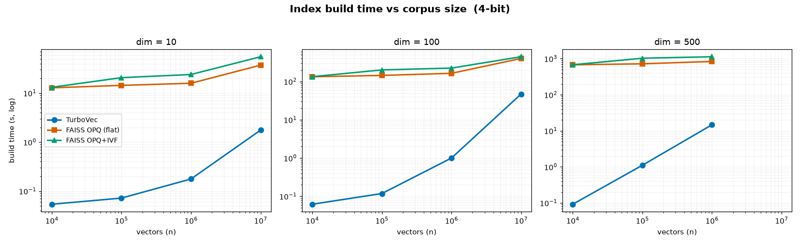
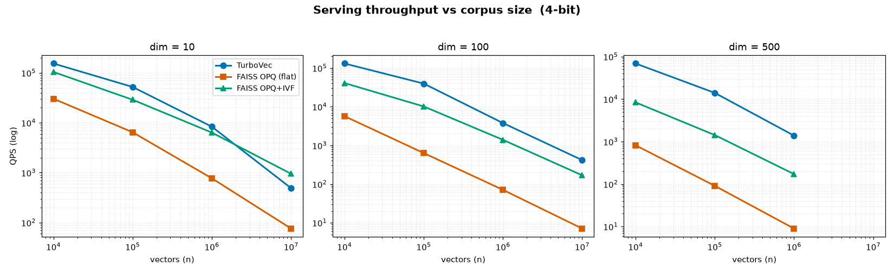
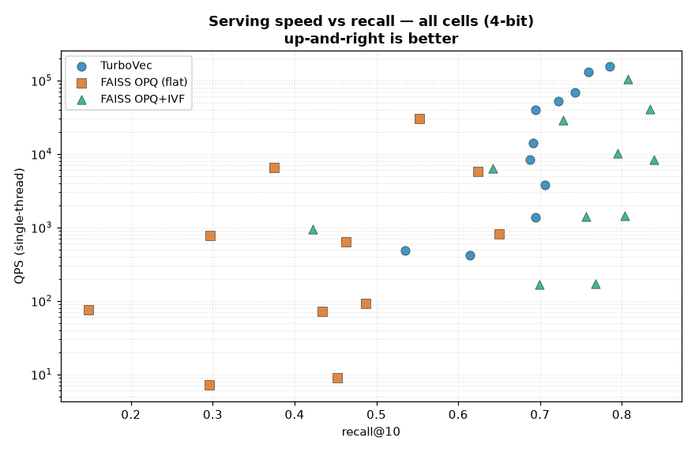
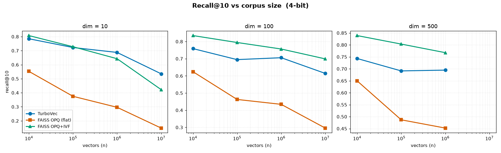
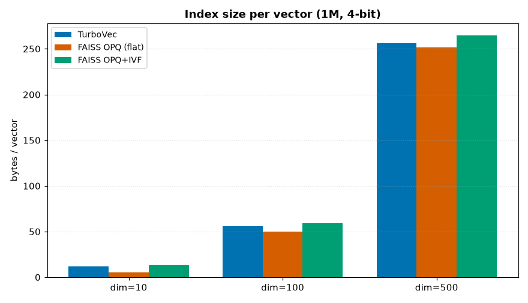

# TurboVec vs FAISS OPQ — Benchmark Report

**Date:** 2026-06-12
**Author:** generated by Claude Code for Zhach Volker
**Scope:** size, indexing time, serving speed, and recall (@1/@10/@100) across a
size × dimension grid.

---

## TL;DR

- **Indexing time — TurboVec wins decisively, everywhere.** TurboVec has no
  training step; it ingests vectors directly. FAISS OPQ must train an OPQ
  rotation + PQ codebooks (and, for the IVF variant, a coarse quantizer). At
  d=500 a single OPQ build runs **7–19 minutes**; TurboVec builds the same data
  in **0.1–15 s** — a **15× to >3000×** speedup depending on the cell.
- **Serving speed — depends on the FAISS configuration you compare against.**
  - vs **flat `OPQ,PQ`** (exhaustive, the apples-to-apples match for TurboVec's
    flat SIMD scan): TurboVec is **2.7×–154× faster QPS**.
  - vs **`OPQ,IVF,PQ`** (the realistic production deployment, which prunes to
    `nprobe` lists): much closer. TurboVec still wins most cells
    (**1.1×–9.8×**), but **IVF's list-pruning overtakes TurboVec at very large
    n + low dim** (10M×10: IVF ~2× faster).
- **Recall — also depends on the comparison.**
  - vs flat OPQ: TurboVec has **higher recall in every cell** (+0.03 to +0.39 @10).
  - vs OPQ+IVF: **mixed** — OPQ+IVF frequently has *higher* recall at 2-bit and
    at d≥100 on this data; TurboVec leads at d=10.
- **On-disk size — close, with caveats.** Flat OPQ is the most compact at low
  dim. TurboVec pads dimension up to a multiple of 8 and has an ~8 byte/vector
  floor, so it is **larger at d=10** but converges to parity at d=100/500.
  TurboVec is **smaller than OPQ+IVF everywhere** (IVF adds coarse-centroid +
  inverted-list overhead).

**Bottom line:** TurboVec's headline advantage is **operational** — zero-train,
near-instant builds and a fast flat SIMD scan with strong recall, with no
parameter tuning. FAISS OPQ's reason to exist at scale is **IVF pruning**; once
you add IVF, OPQ closes most of the serving-speed gap and can match or beat
TurboVec on recall — at the cost of a slow, tuned training step and a coarse
quantizer to maintain.

---

## Methodology

**Engines**
- **TurboVec** `turbovec` 0.8.0 — `TurboQuantIndex(dim, bit_width)`, Google
  TurboQuant, Rust + ARM NEON SIMD. No training; flat exhaustive scan.
- **FAISS OPQ (flat)** — `index_factory(d, "OPQ{m},PQ{m}", METRIC_INNER_PRODUCT)`.
  Exhaustive PQ scan. The controlled match to TurboVec's flat scan.
- **FAISS OPQ+IVF** — `index_factory(d, "OPQ{m},IVF{nlist},PQ{m}", …)`.
  Production-realistic: search probes only `nprobe` of `nlist` lists.

**Grid:** sizes {10k, 100k, 1M, 10M} × dims {10, 100, 500}, **minus 10M×500**
(20 GB raw float32 > 24 GB RAM). Both **2-bit and 4-bit** rates.

**Rate matching:** PQ uses 8-bit sub-quantizers, so `m` sub-quantizers ≈ `8·m/d`
bits/dim. To match TurboVec's 2-/4-bit: `m = d/4` (2-bit) and `m = d/2` (4-bit),
snapped to the nearest divisor of `d`.

**Data:** synthetic clustered embeddings (mixture of Gaussians,
`n_clusters = min(2000, max(64, n/500))`, noise 0.45), **unit-normalized** so
inner product = cosine. Held-out queries from the same distribution
(1000 queries; 500 at 10M).

**Recall:** exact ground truth via `IndexFlatIP`; recall@k = overlap of returned
top-k with exact top-k.

**Fairness controls**
- All searches **single-threaded** (`faiss.omp_set_num_threads(1)`).
- TurboVec needs dim = multiple of 8, so vectors are **zero-padded** (10→16,
  100→104, 500→504); zeros do not change cosine ranking but do count toward
  TurboVec's on-disk size.
- OPQ training is subsampled for tractability (the OPQ rotation cost explodes
  with `m`): **12k** vectors for flat, **100k** for the IVF variant (IVF's
  coarse quantizer needs more points to populate `nlist` centroids). Larger
  samples raise build time without materially improving recall for 256-centroid
  codebooks.
- **IVF parameters (documented, not exhaustively tuned):**
  `nlist = min(4·√n, 4096)` (capped so the training sample gives ≥39 pts/centroid),
  `nprobe = nlist/16` (≈6% of lists scanned). IVF QPS/recall is sensitive to
  these — raising `nprobe` trades QPS for recall.

**Hardware/software:** Apple M4 Pro (14 cores), 24 GB RAM, macOS; Python 3.14,
`faiss-cpu` 1.14.2, `numpy` 2.4.6.

**Reproduce:** `scripts/bench.py` (TurboVec + flat OPQ) then `scripts/bench_ivf.py`
(OPQ+IVF). Raw results: `results/results.csv`.

---

## Headline findings

### 1. Indexing time — TurboVec, by orders of magnitude

TurboVec's "online ingest, no train step" is the single largest gap in the
benchmark. OPQ's iterative rotation training dominates its build and scales
badly with the sub-quantizer count `m` (i.e., with dimension):

| cell | TurboVec build | flat OPQ build | OPQ+IVF build |
|---|---|---|---|
| 1M × 100, 4-bit | **1.0 s** | 163.6 s | 224.2 s |
| 1M × 500, 4-bit | **14.7 s** | 836.7 s | 1131.7 s (~19 min) |
| 10M × 100, 4-bit | **47 s** | 400.1 s | 443.7 s |

This is an operational, not a micro-optimization, difference: rebuilding/
re-sharding indexes, iterating on data, or growing a corpus is effectively free
with TurboVec and a multi-minute batch job with OPQ.

### 2. Serving speed — fair only against OPQ+IVF

Flat OPQ scans every vector, so its QPS collapses at scale (down to **7–20 QPS**
at 1M–10M, d≥100). That is not how OPQ is deployed — production OPQ uses IVF to
probe a small fraction of lists. Against **OPQ+IVF**, the picture is realistic:

| cell | TurboVec QPS | OPQ+IVF QPS | winner |
|---|---|---|---|
| 100k × 100, 4-bit | 39,770 | 10,194 | TurboVec 3.9× |
| 1M × 500, 4-bit | 1,386 | 172 | TurboVec 8.1× |
| 10M × 100, 4-bit | 418 | 169 | TurboVec 2.5× |
| **10M × 10, 4-bit** | 490 | 951 | **OPQ+IVF 1.9×** |

TurboVec's flat SIMD scan wins in most regimes, but at **very large n with low
dim** the per-vector scan cost is tiny and IVF's pruning (skipping ~94% of
lists) overtakes it.

The serving-speed/recall tradeoff across every cell (up-and-right is better):

### 3. Recall — TurboVec beats flat OPQ; OPQ+IVF is competitive

Against flat OPQ, TurboVec wins recall in **every** cell. Against OPQ+IVF the
result is **mixed** — on this cluster-structured data the IVF cells align with
the data's clusters and OPQ+IVF often edges TurboVec at 2-bit and at d≥100:

| cell | TurboVec R@10 | OPQ+IVF R@10 |
|---|---|---|
| 1M × 100, 4-bit | 0.706 | 0.757 |
| 1M × 500, 4-bit | 0.695 | 0.768 |
| 10M × 100, 4-bit | 0.614 | 0.699 |
| 1M × 10, 4-bit | 0.687 | 0.643 |

Low-dim (d=10) recall is poor for all quantizers — PQ at m=2–5 is very coarse,
and d=10 is the hard regime TurboQuant's own docs flag.

### 4. On-disk size

Bytes/vector by engine (independent of n):

| dim | TurboVec 4-bit | flat OPQ 4-bit | OPQ+IVF 4-bit |
|---|---|---|---|
| 10 | 12.0 (pads 10→16) | **6.1** | 15.3 |
| 100 | 56.0 | **51.4** | 59.2 |
| 500 | 256.0 | **251.5** | 264.7 |

Flat OPQ is the most compact (no IVF overhead, no padding). TurboVec's
multiple-of-8 padding and ~8-byte floor make it noticeably larger only at d=10;
at d=100/500 the three are within ~15% of each other.

---

## Per-cell results

## 2-bit

### dim = 10

| n | engine | params | build (s) | size | bytes/vec | QPS | p50 lat (ms) | R@1 | R@10 | R@100 |
|---|--------|--------|-----------|------|-----------|-----|--------------|-----|------|-------|
| 10k | TurboVec | pad_dim=16 | 0.02 | 78.3KB | 8.0 | 162218 | 0.055 | 0.189 | 0.4434 | 0.7946 |
| 10k | FAISS OPQ (flat) | OPQ2,PQ2 | 5.90 | 30.1KB | 3.1 | 39956 | 0.027 | 0.039 | 0.2084 | 0.6928 |
| 10k | FAISS OPQ+IVF | OPQ2,IVF256,PQ2 nprobe=16 | 6.14 | 120.3KB | 12.3 | 107556 | 0.011 | 0.165 | 0.4081 | 0.8039 |
| 100k | TurboVec | pad_dim=16 | 0.03 | 781.4KB | 8.0 | 64216 | 0.162 | 0.087 | 0.2863 | 0.5775 |
| 100k | FAISS OPQ (flat) | OPQ2,PQ2 | 6.68 | 205.9KB | 2.1 | 11016 | 0.090 | 0.012 | 0.0756 | 0.3129 |
| 100k | FAISS OPQ+IVF | OPQ2,IVF1264,PQ2 nprobe=79 | 11.18 | 1.0MB | 10.7 | 30670 | 0.035 | 0.095 | 0.2637 | 0.5579 |
| 1M | TurboVec | pad_dim=16 | 0.12 | 7.6MB | 8.0 | 8880 | 0.984 | 0.042 | 0.1916 | 0.4257 |
| 1M | FAISS OPQ (flat) | OPQ2,PQ2 | 7.63 | 1.9MB | 2.0 | 1568 | 0.636 | 0.007 | 0.043 | 0.1575 |
| 1M | FAISS OPQ+IVF | OPQ2,IVF2564,PQ2 nprobe=160 | 13.98 | 9.7MB | 10.1 | 8042 | 0.127 | 0.065 | 0.1711 | 0.3894 |
| 10M | TurboVec | pad_dim=16 | 1.31 | 76.3MB | 8.0 | 435 | 9.199 | 0.004 | 0.0422 | 0.1883 |
| 10M | FAISS OPQ (flat) | OPQ2,PQ2 | 19.83 | 19.1MB | 2.0 | 161 | 6.513 | 0.0 | 0.0074 | 0.0375 |
| 10M | FAISS OPQ+IVF | OPQ2,IVF2564,PQ2 nprobe=160 | 35.45 | 95.5MB | 10.0 | 1230 | 0.810 | 0.028 | 0.0658 | 0.178 |

### dim = 100

| n | engine | params | build (s) | size | bytes/vec | QPS | p50 lat (ms) | R@1 | R@10 | R@100 |
|---|--------|--------|-----------|------|-----------|-----|--------------|-----|------|-------|
| 10k | TurboVec | pad_dim=104 | 0.03 | 293.8KB | 30.1 | 119803 | 0.066 | 0.204 | 0.4214 | 0.8339 |
| 10k | FAISS OPQ (flat) | OPQ25,PQ25 | 73.58 | 383.4KB | 39.3 | 9792 | 0.107 | 0.12 | 0.3402 | 0.8005 |
| 10k | FAISS OPQ+IVF | OPQ25,IVF256,PQ25 nprobe=16 | 73.83 | 563.6KB | 57.7 | 51264 | 0.024 | 0.304 | 0.5496 | 0.8685 |
| 100k | TurboVec | pad_dim=104 | 0.06 | 2.9MB | 30.0 | 36813 | 0.222 | 0.153 | 0.3091 | 0.5867 |
| 100k | FAISS OPQ (flat) | OPQ25,PQ25 | 80.60 | 2.5MB | 26.4 | 1351 | 0.740 | 0.054 | 0.181 | 0.4711 |
| 100k | FAISS OPQ+IVF | OPQ25,IVF1264,PQ25 nprobe=79 | 115.99 | 3.8MB | 39.6 | 13829 | 0.081 | 0.238 | 0.4257 | 0.6619 |
| 1M | TurboVec | pad_dim=104 | 0.75 | 28.6MB | 30.0 | 6390 | 1.549 | 0.157 | 0.3126 | 0.5866 |
| 1M | FAISS OPQ (flat) | OPQ25,PQ25 | 92.97 | 24.0MB | 25.1 | 139 | 7.119 | 0.051 | 0.1631 | 0.4445 |
| 1M | FAISS OPQ+IVF | OPQ25,IVF2564,PQ25 nprobe=160 | 130.05 | 32.6MB | 34.2 | 2273 | 0.417 | 0.195 | 0.3882 | 0.6323 |
| 10M | TurboVec | pad_dim=104 | 33.57 | 286.1MB | 30.0 | 558 | 15.900 | 0.084 | 0.1792 | 0.3239 |
| 10M | FAISS OPQ (flat) | OPQ25,PQ25 | 261.35 | 238.6MB | 25.0 | 14 | 74.549 | 0.014 | 0.0578 | 0.1667 |
| 10M | FAISS OPQ+IVF | OPQ25,IVF2564,PQ25 nprobe=160 | 283.58 | 315.8MB | 33.1 | 313 | 3.211 | 0.138 | 0.2514 | 0.3915 |

### dim = 500

| n | engine | params | build (s) | size | bytes/vec | QPS | p50 lat (ms) | R@1 | R@10 | R@100 |
|---|--------|--------|-----------|------|-----------|-----|--------------|-----|------|-------|
| 10k | TurboVec | pad_dim=504 | 0.05 | 1.2MB | 130.4 | 88277 | 0.114 | 0.208 | 0.4326 | 0.8294 |
| 10k | FAISS OPQ (flat) | OPQ125,PQ125 | 374.35 | 2.6MB | 276.2 | 1745 | 0.584 | 0.161 | 0.366 | 0.8038 |
| 10k | FAISS OPQ+IVF | OPQ125,IVF256,PQ125 nprobe=16 | 374.94 | 3.2MB | 335.6 | 14909 | 0.089 | 0.311 | 0.5402 | 0.8622 |
| 100k | TurboVec | pad_dim=504 | 0.33 | 12.4MB | 130.0 | 17960 | 0.550 | 0.155 | 0.3324 | 0.5893 |
| 100k | FAISS OPQ (flat) | OPQ125,PQ125 | 416.81 | 13.4MB | 140.1 | 196 | 5.062 | 0.079 | 0.2066 | 0.477 |
| 100k | FAISS OPQ+IVF | OPQ125,IVF1264,PQ125 nprobe=79 | 594.30 | 16.5MB | 173.5 | 3845 | 0.307 | 0.234 | 0.4012 | 0.645 |
| 1M | TurboVec | pad_dim=504 | 4.82 | 124.0MB | 130.0 | 2710 | 4.365 | 0.165 | 0.3361 | 0.5871 |
| 1M | FAISS OPQ (flat) | OPQ125,PQ125 | 493.43 | 120.7MB | 126.5 | 20 | 49.078 | 0.062 | 0.1729 | 0.4555 |
| 1M | FAISS OPQ+IVF | OPQ125,IVF2564,PQ125 nprobe=160 | 651.92 | 133.2MB | 139.7 | 576 | 1.750 | 0.209 | 0.3934 | 0.631 |

## 4-bit

### dim = 10

| n | engine | params | build (s) | size | bytes/vec | QPS | p50 lat (ms) | R@1 | R@10 | R@100 |
|---|--------|--------|-----------|------|-----------|-----|--------------|-----|------|-------|
| 10k | TurboVec | pad_dim=16 | 0.05 | 117.3KB | 12.0 | 154301 | 0.053 | 0.602 | 0.7849 | 0.9355 |
| 10k | FAISS OPQ (flat) | OPQ5,PQ5 | 12.80 | 59.4KB | 6.1 | 30389 | 0.034 | 0.284 | 0.5526 | 0.881 |
| 10k | FAISS OPQ+IVF | OPQ5,IVF256,PQ5 nprobe=16 | 13.11 | 149.6KB | 15.3 | 104548 | 0.012 | 0.587 | 0.8075 | 0.9447 |
| 100k | TurboVec | pad_dim=16 | 0.07 | 1.1MB | 12.0 | 52286 | 0.169 | 0.532 | 0.7225 | 0.8569 |
| 100k | FAISS OPQ (flat) | OPQ5,PQ5 | 14.34 | 498.8KB | 5.1 | 6467 | 0.154 | 0.172 | 0.3748 | 0.6554 |
| 100k | FAISS OPQ+IVF | OPQ5,IVF1264,PQ5 nprobe=79 | 20.62 | 1.3MB | 13.7 | 28986 | 0.038 | 0.494 | 0.7281 | 0.8843 |
| 1M | TurboVec | pad_dim=16 | 0.18 | 11.4MB | 12.0 | 8365 | 1.050 | 0.54 | 0.6874 | 0.8103 |
| 1M | FAISS OPQ (flat) | OPQ5,PQ5 | 15.85 | 4.8MB | 5.0 | 773 | 1.283 | 0.136 | 0.2964 | 0.5334 |
| 1M | FAISS OPQ+IVF | OPQ5,IVF2564,PQ5 nprobe=160 | 23.92 | 12.5MB | 13.1 | 6376 | 0.153 | 0.396 | 0.6427 | 0.8142 |
| 10M | TurboVec | pad_dim=16 | 1.76 | 114.4MB | 12.0 | 490 | 9.950 | 0.352 | 0.5352 | 0.6961 |
| 10M | FAISS OPQ (flat) | OPQ5,PQ5 | 37.10 | 47.7MB | 5.0 | 76 | 13.570 | 0.052 | 0.1484 | 0.302 |
| 10M | FAISS OPQ+IVF | OPQ5,IVF2564,PQ5 nprobe=160 | 55.09 | 124.1MB | 13.0 | 951 | 1.054 | 0.228 | 0.4224 | 0.6473 |

### dim = 100

| n | engine | params | build (s) | size | bytes/vec | QPS | p50 lat (ms) | R@1 | R@10 | R@100 |
|---|--------|--------|-----------|------|-----------|-----|--------------|-----|------|-------|
| 10k | TurboVec | pad_dim=104 | 0.06 | 547.7KB | 56.1 | 131480 | 0.073 | 0.593 | 0.7587 | 0.9341 |
| 10k | FAISS OPQ (flat) | OPQ50,PQ50 | 132.95 | 627.5KB | 64.3 | 5713 | 0.176 | 0.403 | 0.6243 | 0.8995 |
| 10k | FAISS OPQ+IVF | OPQ50,IVF256,PQ50 nprobe=16 | 133.52 | 807.7KB | 82.7 | 40991 | 0.030 | 0.7 | 0.8347 | 0.9547 |
| 100k | TurboVec | pad_dim=104 | 0.12 | 5.3MB | 56.0 | 39770 | 0.297 | 0.568 | 0.6947 | 0.836 |
| 100k | FAISS OPQ (flat) | OPQ50,PQ50 | 144.24 | 4.9MB | 51.4 | 636 | 1.435 | 0.274 | 0.4627 | 0.6999 |
| 100k | FAISS OPQ+IVF | OPQ50,IVF1264,PQ50 nprobe=79 | 200.83 | 6.2MB | 64.6 | 10194 | 0.104 | 0.688 | 0.7944 | 0.8907 |
| 1M | TurboVec | pad_dim=104 | 1.00 | 53.4MB | 56.0 | 3796 | 2.276 | 0.555 | 0.7058 | 0.8371 |
| 1M | FAISS OPQ (flat) | OPQ50,PQ50 | 163.60 | 47.8MB | 50.1 | 71 | 13.295 | 0.229 | 0.4342 | 0.6792 |
| 1M | FAISS OPQ+IVF | OPQ50,IVF2564,PQ50 nprobe=160 | 224.15 | 56.4MB | 59.2 | 1398 | 0.724 | 0.635 | 0.7565 | 0.8711 |
| 10M | TurboVec | pad_dim=104 | 47.02 | 534.1MB | 56.0 | 418 | 23.204 | 0.438 | 0.6144 | 0.7121 |
| 10M | FAISS OPQ (flat) | OPQ50,PQ50 | 400.13 | 477.0MB | 50.0 | 7 | 136.234 | 0.182 | 0.296 | 0.4494 |
| 10M | FAISS OPQ+IVF | OPQ50,IVF2564,PQ50 nprobe=160 | 443.70 | 554.3MB | 58.1 | 169 | 5.901 | 0.566 | 0.699 | 0.7835 |

### dim = 500

| n | engine | params | build (s) | size | bytes/vec | QPS | p50 lat (ms) | R@1 | R@10 | R@100 |
|---|--------|--------|-----------|------|-----------|-----|--------------|-----|------|-------|

---

| 10k | FAISS OPQ (flat) | OPQ250,PQ250 | 674.74 | 3.8MB | 401.2 | 821 | 1.199 | 0.418 | 0.6497 | 0.9012 |
| 10k | FAISS OPQ+IVF | OPQ250,IVF256,PQ250 nprobe=16 | 677.42 | 4.4MB | 460.6 | 8404 | 0.135 | 0.734 | 0.8389 | 0.9545 |
| 100k | TurboVec | pad_dim=504 | 1.11 | 24.4MB | 256.0 | 14068 | 0.879 | 0.535 | 0.6912 | 0.8281 |
| 100k | FAISS OPQ (flat) | OPQ250,PQ250 | 721.01 | 25.3MB | 265.1 | 91 | 10.865 | 0.348 | 0.4868 | 0.7039 |
| 100k | FAISS OPQ+IVF | OPQ250,IVF1264,PQ250 nprobe=79 | 1028.97 | 28.5MB | 298.5 | 1429 | 0.748 | 0.714 | 0.8034 | 0.8902 |
| 1M | TurboVec | pad_dim=504 | 14.68 | 244.1MB | 256.0 | 1386 | 8.059 | 0.566 | 0.6945 | 0.8273 |
| 1M | FAISS OPQ (flat) | OPQ250,PQ250 | 836.66 | 239.9MB | 251.5 | 9 | 110.542 | 0.267 | 0.4523 | 0.6815 |
| 1M | FAISS OPQ+IVF | OPQ250,IVF2564,PQ250 nprobe=160 | 1131.65 | 252.4MB | 264.7 | 172 | 5.868 | 0.632 | 0.7675 | 0.8688 |

## Head-to-head ratios (TurboVec vs FAISS OPQ)

Ratio >1 favours TurboVec for QPS/build; <1 favours the FAISS variant. R@10 delta = TV minus variant (positive => TV higher recall).

### TurboVec vs flat OPQ,PQ

| n | dim | bit | size TV/v | build TV/v | QPS TV/v | R@10 TV-v |
|---|-----|-----|-----------|------------|----------|-----------|
| 10k | 10 | 2 | 2.60x | 0.003x | 4.1x | +0.235 |
| 10k | 100 | 2 | 0.77x | 0.000x | 12.2x | +0.081 |
| 10k | 500 | 2 | 0.47x | 0.000x | 50.6x | +0.067 |
| 100k | 10 | 2 | 3.80x | 0.004x | 5.8x | +0.211 |
| 100k | 100 | 2 | 1.14x | 0.001x | 27.2x | +0.128 |
| 100k | 500 | 2 | 0.93x | 0.001x | 91.5x | +0.126 |
| 1M | 10 | 2 | 3.98x | 0.016x | 5.7x | +0.149 |
| 1M | 100 | 2 | 1.19x | 0.008x | 46.0x | +0.149 |
| 1M | 500 | 2 | 1.03x | 0.010x | 137.6x | +0.163 |
| 10M | 10 | 2 | 4.00x | 0.066x | 2.7x | +0.035 |
| 10M | 100 | 2 | 1.20x | 0.128x | 40.4x | +0.121 |
| 10k | 10 | 4 | 1.98x | 0.004x | 5.1x | +0.232 |
| 10k | 100 | 4 | 0.87x | 0.000x | 23.0x | +0.134 |
| 10k | 500 | 4 | 0.64x | 0.000x | 84.2x | +0.093 |
| 100k | 10 | 4 | 2.35x | 0.005x | 8.1x | +0.348 |
| 100k | 100 | 4 | 1.09x | 0.001x | 62.6x | +0.232 |
| 100k | 500 | 4 | 0.97x | 0.002x | 154.2x | +0.204 |
| 1M | 10 | 4 | 2.39x | 0.011x | 10.8x | +0.391 |
| 1M | 100 | 4 | 1.12x | 0.006x | 53.4x | +0.272 |
| 1M | 500 | 4 | 1.02x | 0.018x | 154.0x | +0.242 |
| 10M | 10 | 4 | 2.40x | 0.047x | 6.4x | +0.387 |
| 10M | 100 | 4 | 1.12x | 0.118x | 58.8x | +0.318 |

### TurboVec vs OPQ+IVF+PQ

| n | dim | bit | size TV/v | build TV/v | QPS TV/v | R@10 TV-v |
|---|-----|-----|-----------|------------|----------|-----------|
| 10k | 10 | 2 | 0.65x | 0.003x | 1.5x | +0.035 |
| 10k | 100 | 2 | 0.52x | 0.000x | 2.3x | -0.128 |
| 10k | 500 | 2 | 0.39x | 0.000x | 5.9x | -0.108 |
| 100k | 10 | 2 | 0.75x | 0.002x | 2.1x | +0.023 |
| 100k | 100 | 2 | 0.76x | 0.001x | 2.7x | -0.117 |
| 100k | 500 | 2 | 0.75x | 0.001x | 4.7x | -0.069 |
| 1M | 10 | 2 | 0.79x | 0.009x | 1.1x | +0.020 |
| 1M | 100 | 2 | 0.88x | 0.006x | 2.8x | -0.076 |
| 1M | 500 | 2 | 0.93x | 0.007x | 4.7x | -0.057 |
| 10M | 10 | 2 | 0.80x | 0.037x | 0.4x | -0.024 |
| 10M | 100 | 2 | 0.91x | 0.118x | 1.8x | -0.072 |
| 10k | 10 | 4 | 0.78x | 0.004x | 1.5x | -0.023 |
| 10k | 100 | 4 | 0.68x | 0.000x | 3.2x | -0.076 |
| 10k | 500 | 4 | 0.56x | 0.000x | 8.2x | -0.096 |
| 100k | 10 | 4 | 0.88x | 0.003x | 1.8x | -0.006 |
| 100k | 100 | 4 | 0.87x | 0.001x | 3.9x | -0.100 |
| 100k | 500 | 4 | 0.86x | 0.001x | 9.8x | -0.112 |
| 1M | 10 | 4 | 0.91x | 0.007x | 1.3x | +0.045 |
| 1M | 100 | 4 | 0.95x | 0.004x | 2.7x | -0.051 |
| 1M | 500 | 4 | 0.97x | 0.013x | 8.1x | -0.073 |
| 10M | 10 | 4 | 0.92x | 0.032x | 0.5x | +0.113 |
| 10M | 100 | 4 | 0.96x | 0.106x | 2.5x | -0.085 |

---

## Caveats & threats to validity

1. **Synthetic data.** Vectors are mixtures of Gaussians, not real embeddings.
   Absolute recall numbers are **not** representative of production embeddings —
   treat the **relative** engine comparison as the signal, not the absolute
   recall. Cluster-structured data also flatters IVF (its coarse cells align
   with the planted clusters); on less-clustered real embeddings OPQ+IVF's recall
   edge may shrink. TurboQuant's own docs report it beating FAISS `IndexPQ` on
   real OpenAI/GloVe embeddings.
2. **IVF not tuned per recall target.** `nprobe` is fixed at ~6% of `nlist`. The
   QPS/recall numbers are one point on a curve; raising `nprobe` raises IVF
   recall and lowers its QPS. A production OPQ+IVF would tune `nprobe` to a
   recall SLO.
3. **OPQ training subsampled** (12k flat / 100k IVF) to keep build times
   tractable at high `m`. Full-corpus training could shift OPQ recall slightly
   (and would make its already-slow builds far slower).
4. **Single-threaded.** Both engines pinned to one thread for a fair compare.
   Absolute QPS would rise with threads; TurboVec's hand-written NEON kernel and
   FAISS's threading scale differently, so multi-thread ratios may differ.
5. **10M×500 skipped** — 20 GB raw float32 exceeds the 24 GB test box.
6. **TurboVec dim padding** to a multiple of 8 inflates d=10 storage (10→16) and
   adds wasted scan work on pad dimensions; a dim already a multiple of 8 avoids
   this.
7. **FAISS version.** Benchmarked on `faiss-cpu` 1.14.2; a different deployed
   faiss version (e.g. 1.8.x) may have kernel/codepath differences.

---

## When to pick which

- **TurboVec is most compelling where build cadence and operational simplicity
  matter.** Zero training, near-instant rebuilds, no `nlist`/`nprobe`/OPQ-rotation
  tuning, and strong recall on a flat scan. If per-index (or per-shard) `n` is in
  the ~10k–1M range, a flat TurboVec scan is both faster (QPS) and dramatically
  cheaper to (re)build than OPQ, and sidesteps the multi-minute OPQ training
  entirely. Frequent reindexing / online ingest is where its no-train design
  pays off most.
- **OPQ+IVF stays preferable when** a single node holds a very large corpus at
  low dimension (IVF pruning beats exhaustive scan — see 10M×10), or when recall
  must be dialed in via `nprobe` and the slow, tuned training step is acceptable.
- **Before relying on these numbers,** rerun this harness on **your real
  embeddings** at the **actual index size and dimension**, and tune OPQ+IVF
  `nprobe` to your recall target so the comparison reflects your operating
  point — the synthetic recall here is directional only.

---

## Files

- `scripts/bench.py` — TurboVec + flat OPQ pass
- `scripts/bench_ivf.py` — OPQ+IVF pass (appends to the same CSV)
- `scripts/make_report.py` — regenerates the tables in this report from the CSV
- `scripts/plot.py` — regenerates the figures in `report/figures/` from the CSV
- `results/results.csv` — all 66 rows (raw)
